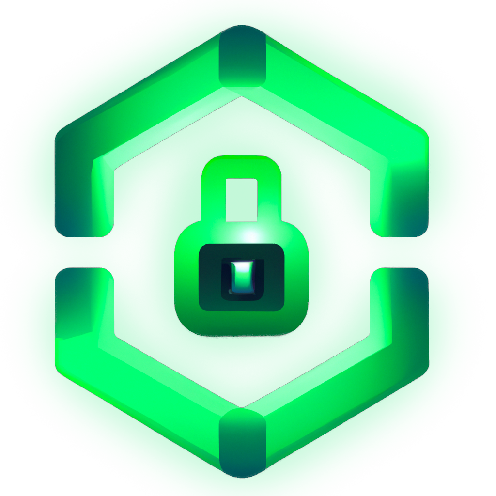
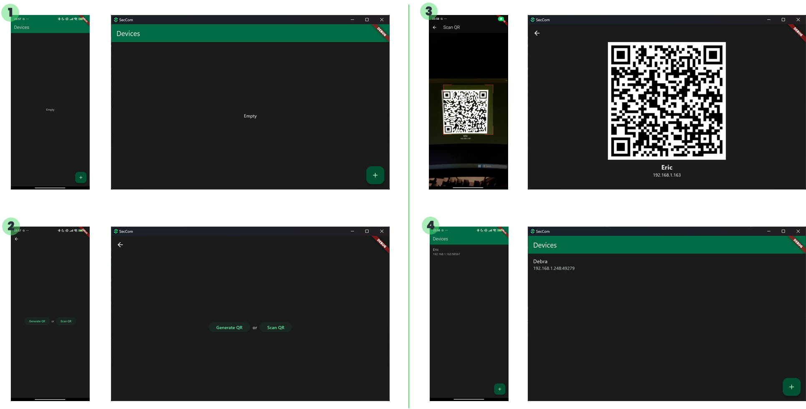
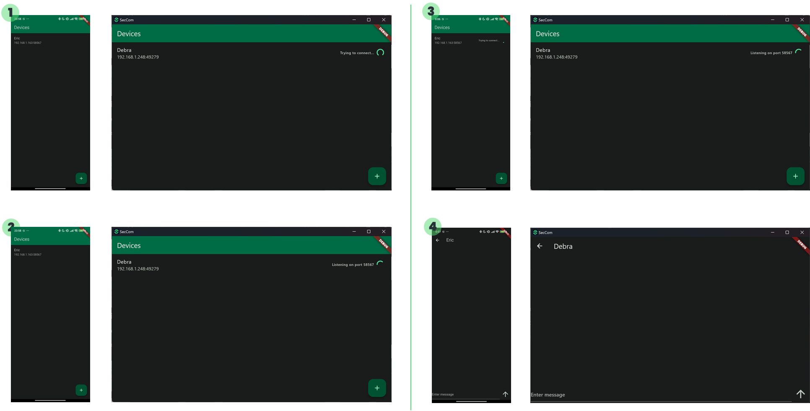
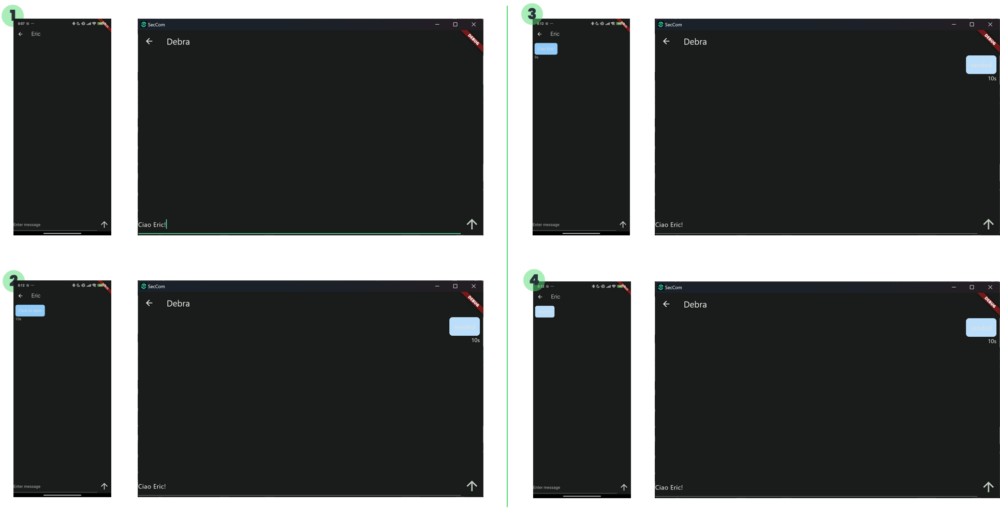

[![Contributors][contributors-shield]][contributors-url]
[![Forks][forks-shield]][forks-url]
[![Stargazers][stars-shield]][stars-url]
[![Issues][issues-shield]][issues-url]
[![MIT License][license-shield]][license-url]
[![LinkedIn][linkedin-shield]][linkedin-url]

<!-- PROJECT LOGO -->
 

  

  <h3 align="center">SecCom</h3>

  

    Connect Securely, Communicate Seamlessly.
     
     
  

<!-- TABLE OF CONTENTS -->

  
Sommario

  <ol>
    <li>
      <a href="#about-the-project">Il Progetto</a>
      <ul>
        <li><a href="#frameworks">Frameworks</a></li>
        <li><a href="#compatibility">Compatibilità</a></li>
      </ul>
    </li>
    <li>
      <a href="#getting-started">Per iniziare</a>
      <ul>
        <li><a href="#prerequisites">Prerequisiti</a></li>
        <li><a href="#installation">Installazione</a></li>
      </ul>
    </li>
    <li><a href="#usage">Utilizzo</a></li>
    <li><a href="#roadmap">Roadmap</a></li>
    <li><a href="#license">Licenza</a></li>
    <li><a href="#contact">Contatti</a></li>
  </ol>

<!-- ABOUT THE PROJECT -->
## Il Progetto

![SecCom Screenshot][product-screenshot]

SecCom è un'applicazione che permette di comunicare in maniera sicura e diretta con altri dispositivi.
Si tratta di un'applicazione Peer-to-Peer che consente di scambiare messaggi cifrati e dotati di scadenza con lo scopo di migliorare la sicurezza in specifici ambiti di utilizzo.

(<a href="#readme-top">back to top</a>)

### Frameworks

[![Flutter][Flutter]][Flutter-url]

### Compatibilità

L'applicazione è compatibile con le seguenti piattaforme e le relative versioni minime:

- [![Android][Android]][Android-url] (✅tested)
- [![Windows][Windows]][Windows-url] (✅tested)
- ![IOS][IOS]
- ![MacOS][MacOS]

(<a href="#readme-top">back to top</a>)

<!-- GETTING STARTED -->
## Per iniziare

Per installare l'applicazione è sufficiente seguire le seguenti istruzioni.

### Prerequisiti

Per avviare l'applicazione è necessario possedere dispositivo compatibile.
Vedi: <a href="#compatibility">Compatibilità</a>.

### Installazione

Scarica e installa l'ultima versione dell'applicazione dalla pagina delle [releases](https://github.com/BrianSivAir/SecCom/releases).

(<a href="#readme-top">back to top</a>)

<!-- USAGE EXAMPLES -->
## Utilizzo

### Accoppiamento

1. Situazione iniziale
2. Schermata di accoppiamento
3. Smartphone: Scansione QR | Desktop: Visualizzazione QR
4. Accoppiamento effettuato

### Connessione

1. Desktop: Tentativo di connessione
2. Desktop: Il destinatario non è raggiungibile o non è in ascolto. Il mittente inizia ad ascoltare
3. Smartphone: Tentativo di connessione al destinatario
4. Il destinatario era in ascolto. Connessione effettuata

### Messaggistica

1. Visualizzazione chat
2. Desktop: invio di un messaggio con TTL = 10s | Smartphone: ricezione del messaggio cifrato
3. Smartphone: Apertura del messaggio e inizio del conto alla rovescia
4. Smartphone: Fine del conto alla rovescia ed eliminazione definitiva del messaggio

(<a href="#readme-top">back to top</a>)

<!-- ROADMAP -->
## Roadmap

- [x] Persistenza locale: Configurazione di un database locale per gestire i dispositivi
- [x] Socket factory: Impostazione di una modalità di comunicazione TCP simmetrica per entrambe le parti
- [x] Cifratura: Impostazione del sistema di cifratura
- [x] Messaggi: Definizione e struttura di un messaggio e la relativa gestione da parte del destinatario
- [x] Accoppiamento: Impostazione della procedura di accoppiamento e scambio delle chiavi
- [ ] CRUD Dispositivi: Gestione di inserimento manuale, modifica e cancellazione di dispositivi 

Vedi le [issues aperte](https://github.com/BrianSivAir/SecCom/issues) per la lista completa di funzionalità proposte (e problemi noti).

(<a href="#readme-top">back to top</a>)

<!-- LICENSE -->
## Licenza

Distributed under the MIT License. See `LICENSE.txt` for more information.

(<a href="#readme-top">back to top</a>)

<!-- CONTACT -->
## Contatti

Brian Sivieri - briansivieri.job@gmail.com

Link Progetto: [https://github.com/BrianSivAir/SecCom](https://github.com/BrianSivAir/SecCom)

(<a href="#readme-top">back to top</a>)

<!-- MARKDOWN LINKS & IMAGES -->
<!-- https://www.markdownguide.org/basic-syntax/#reference-style-links -->
[contributors-shield]: https://img.shields.io/github/contributors/BrianSivAir/SecCom.svg?style=for-the-badge
[contributors-url]: https://github.com/BrianSivAir/SecCom/graphs/contributors
[forks-shield]: https://img.shields.io/github/forks/BrianSivAir/SecCom.svg?style=for-the-badge
[forks-url]: https://github.com/BrianSivAir/SecCom/network/members
[stars-shield]: https://img.shields.io/github/stars/BrianSivAir/SecCom.svg?style=for-the-badge
[stars-url]: https://github.com/BrianSivAir/SecCom/stargazers
[issues-shield]: https://img.shields.io/github/issues/BrianSivAir/SecCom.svg?style=for-the-badge
[issues-url]: https://github.com/BrianSivAir/SecCom/issues
[license-shield]: https://img.shields.io/github/license/BrianSivAir/SecCom.svg?style=for-the-badge
[license-url]: https://github.com/BrianSivAir/SecCom/blob/master/LICENSE.txt
[linkedin-shield]: https://img.shields.io/badge/-LinkedIn-black.svg?style=for-the-badge&logo=linkedin&colorB=555
[linkedin-url]: https://linkedin.com/in/brian-sivieri
[product-screenshot]: images/screenshot.jpg
[Next.js]: https://img.shields.io/badge/next.js-000000?style=for-the-badge&logo=nextdotjs&logoColor=white
[Flutter]: https://img.shields.io/badge/flutter-3.19.2-000000?style=for-the-badge&logo=flutter&logoColor=white
[Android]: https://img.shields.io/badge/android-5.0-34a853?style=for-the-badge&logo=android&logoColor=34a853
[Windows]: https://img.shields.io/badge/windows-7-0178d4?style=for-the-badge&logo=windows&logoColor=0178d4
[MacOS]: https://img.shields.io/badge/macos-10.11-171719?style=for-the-badge&logo=macos&logoColor=171719
[IOS]: https://img.shields.io/badge/ios-11-507fc9?style=for-the-badge&logo=ios&logoColor=507fc9
[Next-url]: https://nextjs.org/
[Flutter-url]: https://flutter.dev/
[Android-url]: https://android.com/
[Windows-url]: https://windows.com/
[React.js]: https://img.shields.io/badge/React-20232A?style=for-the-badge&logo=react&logoColor=61DAFB
[React-url]: https://reactjs.org/
[Vue.js]: https://img.shields.io/badge/Vue.js-35495E?style=for-the-badge&logo=vuedotjs&logoColor=4FC08D
[Vue-url]: https://vuejs.org/
[Angular.io]: https://img.shields.io/badge/Angular-DD0031?style=for-the-badge&logo=angular&logoColor=white
[Angular-url]: https://angular.io/
[Svelte.dev]: https://img.shields.io/badge/Svelte-4A4A55?style=for-the-badge&logo=svelte&logoColor=FF3E00
[Svelte-url]: https://svelte.dev/
[Laravel.com]: https://img.shields.io/badge/Laravel-FF2D20?style=for-the-badge&logo=laravel&logoColor=white
[Laravel-url]: https://laravel.com
[Bootstrap.com]: https://img.shields.io/badge/Bootstrap-563D7C?style=for-the-badge&logo=bootstrap&logoColor=white
[Bootstrap-url]: https://getbootstrap.com
[JQuery.com]: https://img.shields.io/badge/jQuery-0769AD?style=for-the-badge&logo=jquery&logoColor=white
[JQuery-url]: https://jquery.com 
